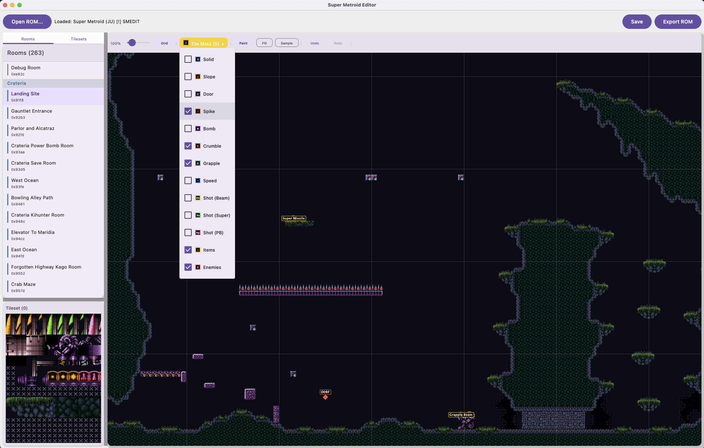
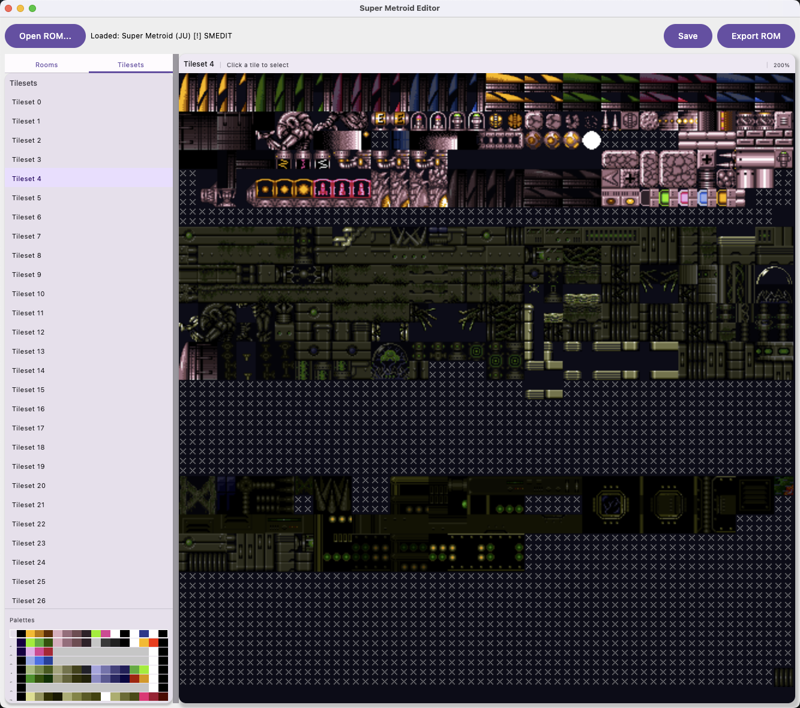

# Super Metroid Editor (SMEDIT)


The MS Paint of Super Metroid editing. A native desktop ROM editor built with Kotlin/Compose.




## What it does

- Load and parse Super Metroid `.smc` / `.sfc` ROMs
- Browse all 263 rooms by area (Crateria, Brinstar, Norfair, etc.)
- Full tile-accurate room rendering with real tileset graphics
- Paint, fill, and sample tiles with multi-tile brush support
- Right-click any block to edit block type and BTS properties
- Place and remove items/powerups with correct PLM IDs
- Tileset browser with all 29 tilesets, palette visualization, and per-tile default editing
- Toggleable overlays: solid, slope, door, spike, bomb, crumble, grapple, speed, shot blocks (beam/super/PB), items, enemies
- Enemy and item markers rendered on the map with names
- Undo/redo, project save/load (`.smedit` JSON), export patched ROM
- Pinch-to-zoom, middle-click pan, keyboard shortcuts

## Building

Requires JDK 17+ and Gradle 8.5+.

```bash
./gradlew :desktopApp:run
```

## Roadmap

- Direct tileset image editing and tile swapping
- Custom tileset importing
- Enemy placement and editing
- FX / scrolling / background layer editing
- Room creation, resizing, and state management
- Binary-level ROM patching (free space management, pointer rewriting, bank expansion)
- IPS/BPS patch export
- Sprite viewer and palette editor

## References

- [Metroid Construction Wiki](https://wiki.metroidconstruction.com/)
- [Kejardon's SM Documentation](https://patrickjohnston.org/ASM/ROM%20data/Super%20Metroid/Kejardon's%20docs/)
- [SMILE Editor](https://wiki.metroidconstruction.com/doku.php?id=sm:editor_utility_guides:smile2.5)
