#  Super Metroid Editor (SMEDIT)

The MS Paint of Super Metroid ROM hacking. A native cross-platform desktop editor built with Kotlin/Compose.

<p>
  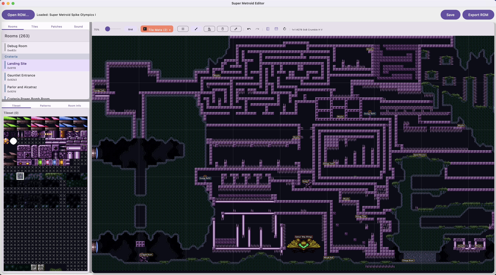
  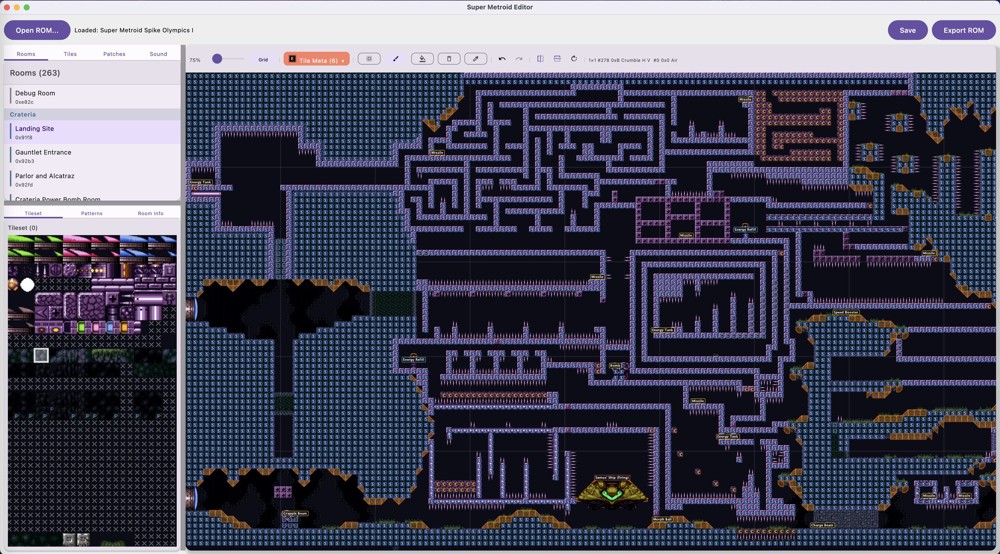
</p>

Exported Room Images

<p>
  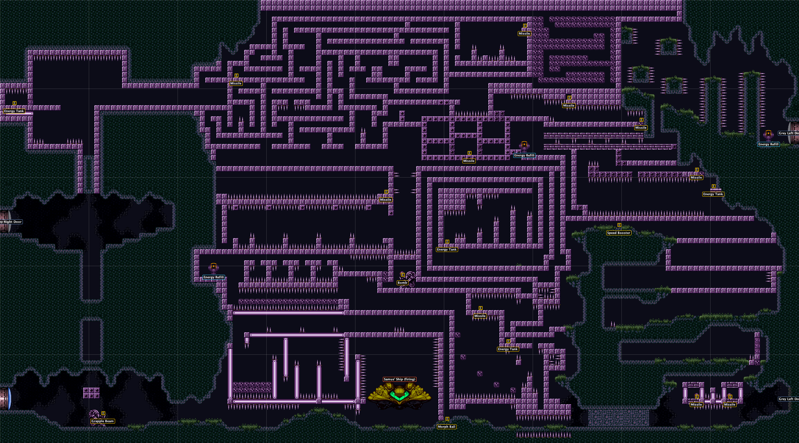
  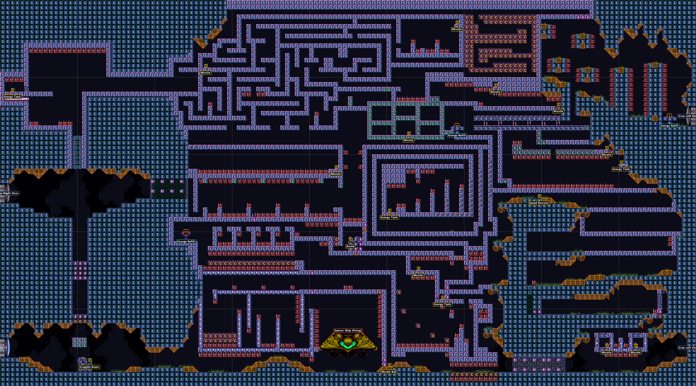
</p>

Tile Editor

<p>
  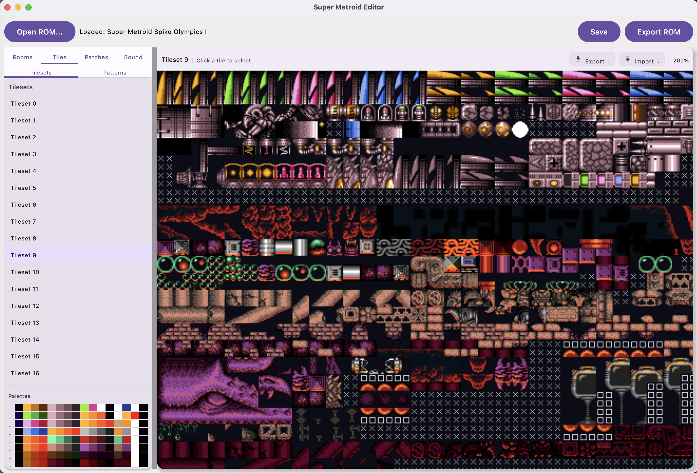
  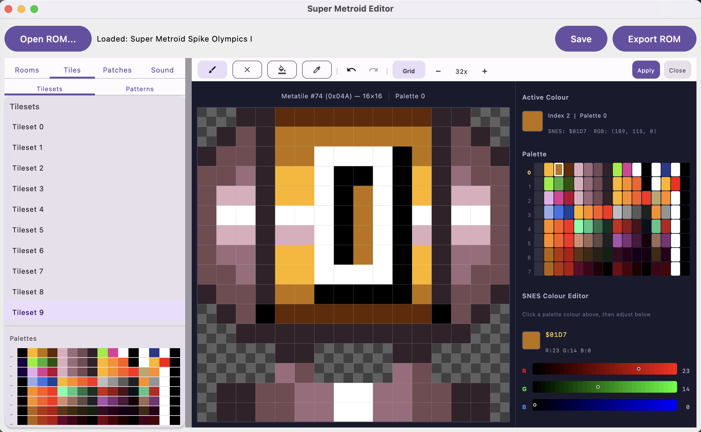
</p>

<p>
  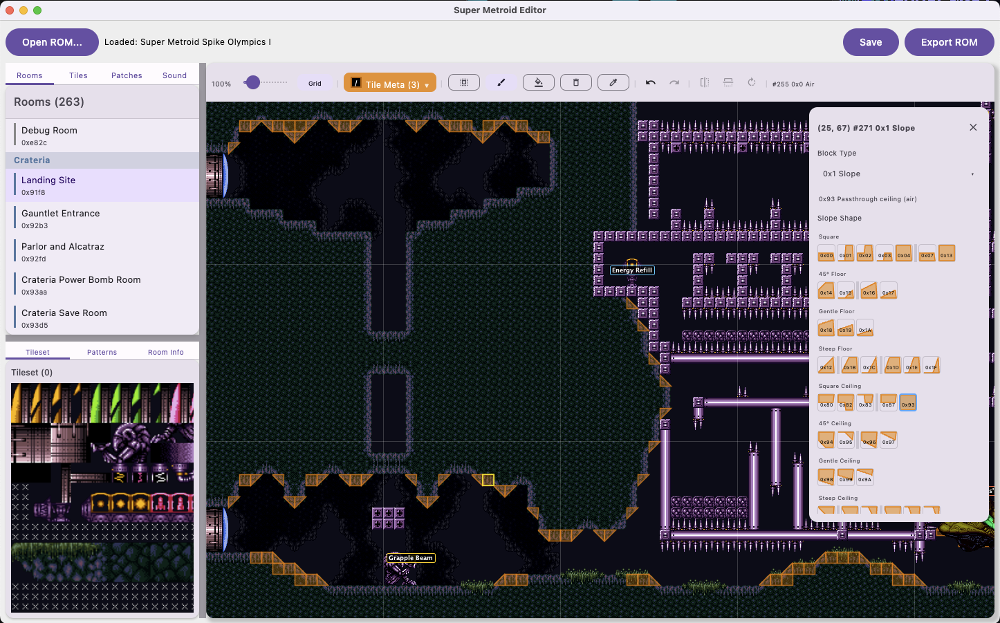
  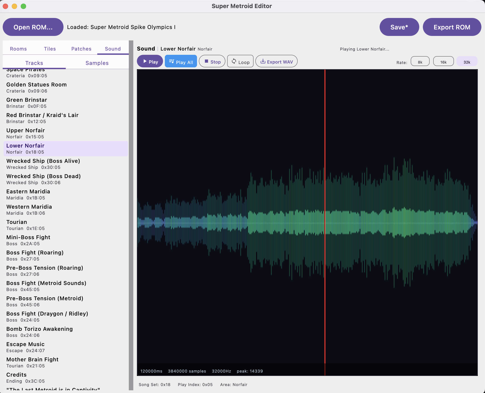
</p>

Sprite Editor

<p>
  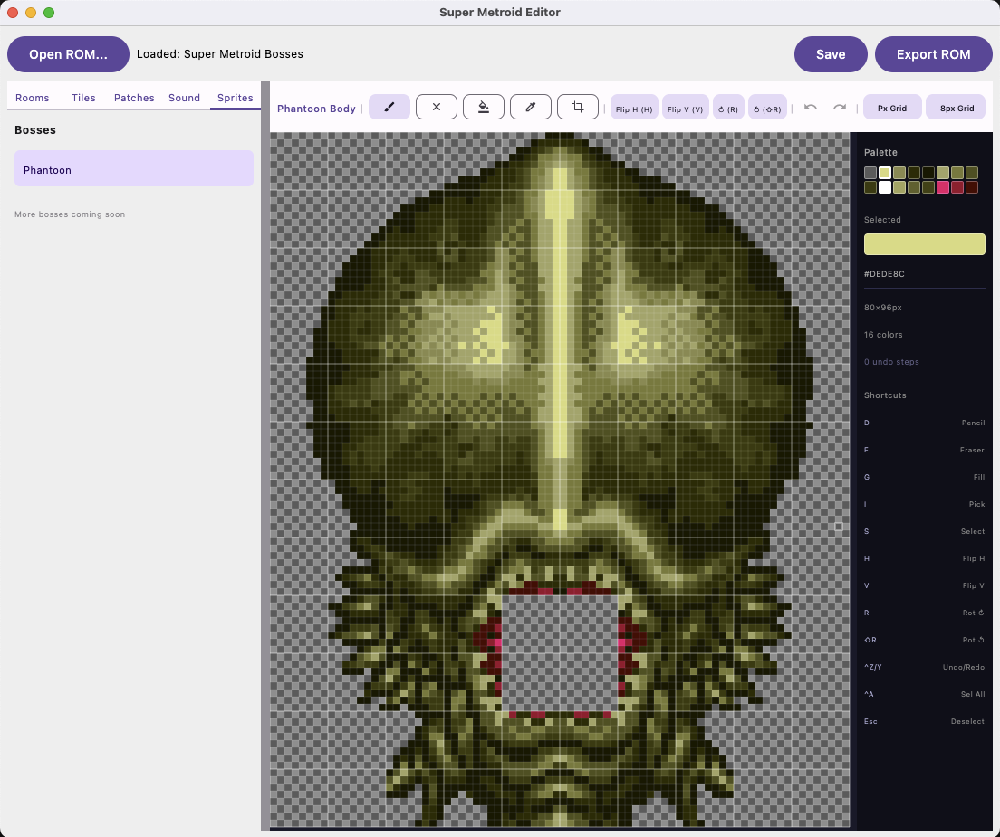
  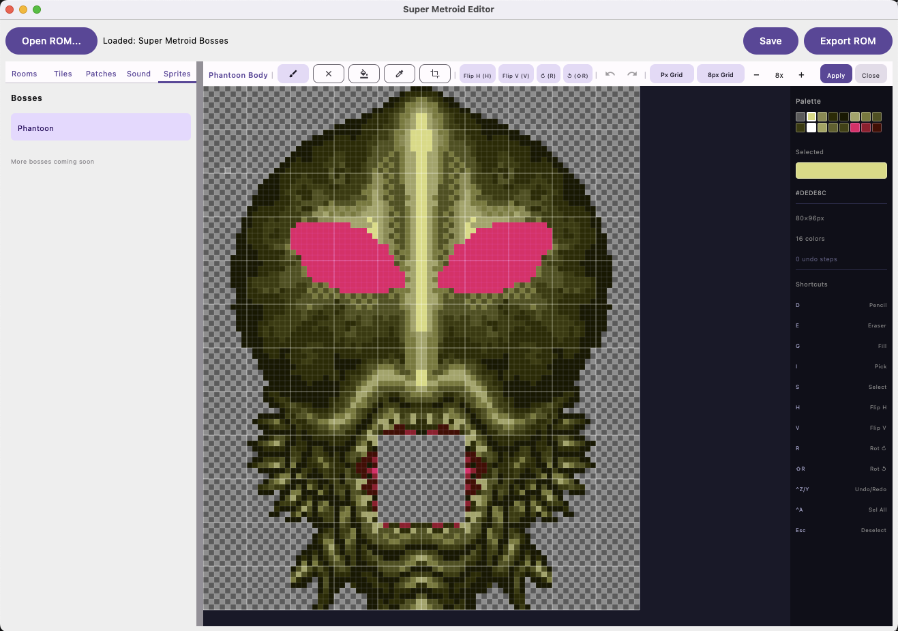
</p>
<p>
  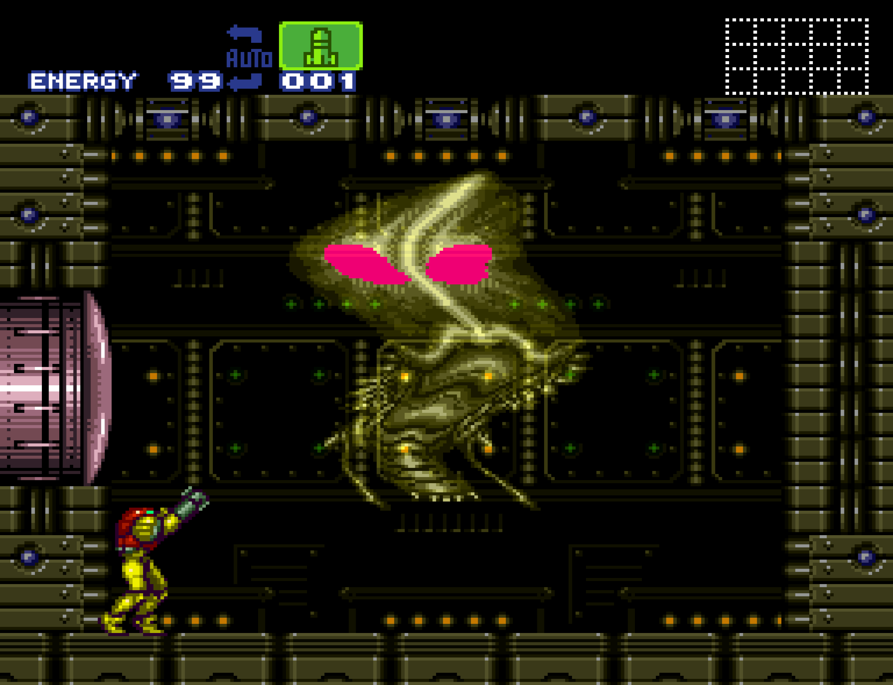
  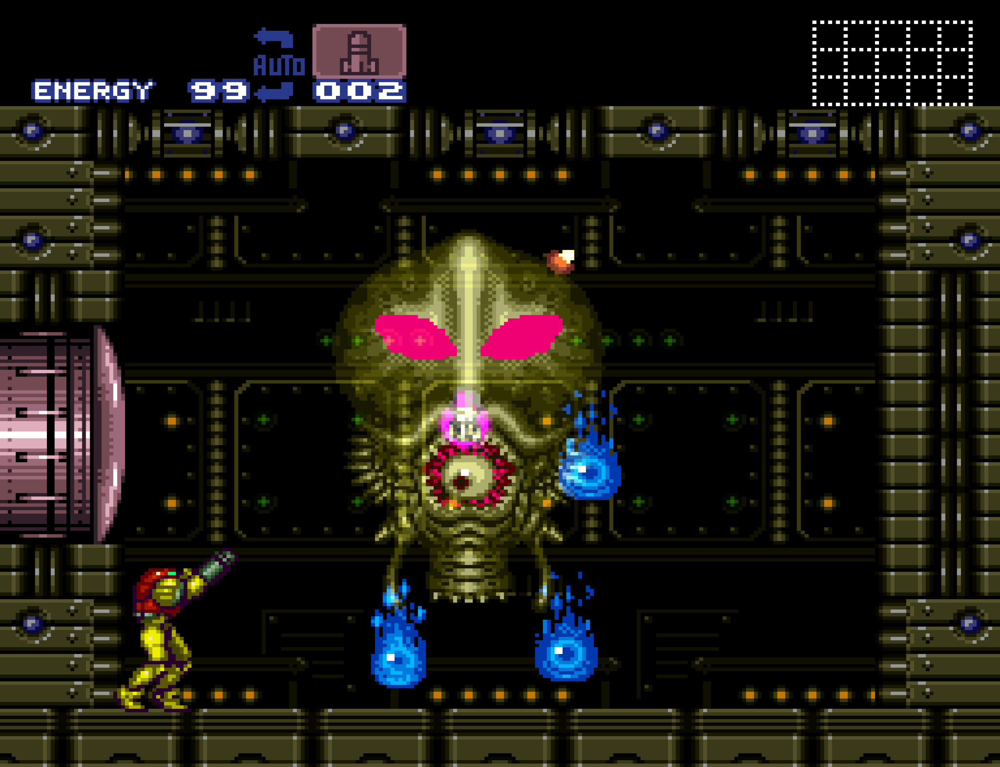
</p>


Misc

<p>
  
  
</p>


## Features

- **Room Editor** — Paint, fill, erase, and sample tiles with multi-tile brush support. Right-click any block to edit block type and BTS properties. Undo/redo with full history.
- **PLM Placement** — Place and remove doors, gates, items, save stations, refill stations, and other PLMs with correct IDs and parameters.
- **Enemy Editor** — View, place, and edit enemy positions and properties per room.
- **Tileset Browser** — Browse all 29 tilesets with palette visualization and per-tile defaults.
- **Pattern System** — Save reusable tile patterns (doors, gates, platforms). Built-in patterns for all door/gate colors and directions.
- **Patch Manager** — Apply, create, and manage IPS patches. Built-in patches for common hacks (beam damage, jump height, Ceres escape time).
- **Sound Editor** — Browse and preview all in-game music tracks with cycle-accurate SPC700 emulation via blargg's snes_spc.
- **Block Overlays** — Toggleable overlays for solid, slope, door, spike, bomb, crumble, grapple, speed, shot blocks, items, and enemies.
- **Room Browser** — Browse all 263 rooms organized by area (Crateria, Brinstar, Norfair, Wrecked Ship, Maridia, Tourian, Ceres).
- **Project Files** — Save/load projects as `.smedit` JSON files. Export patched ROMs.
- **Cross-Platform** — macOS (`.dmg`), Windows (`.msi`), and Linux (`.deb`) builds with bundled JRE.

## Download

Grab the latest release for your platform from [GitHub Releases](https://github.com/kennycason/super_metroid_editor/releases).

| Platform | Format |
|----------|--------|
| macOS    | `.dmg` |
| Windows  | `.msi` |
| Linux    | `.deb` |

## Building from Source

Requires JDK 17+ and a C++ compiler (Xcode CLI tools on macOS, `g++` on Linux, MinGW on Windows).

### Quickstart with mise

The repo now includes a local `mise` toolchain for the BizHawk-first emulator checks.

```bash
mise install
mise run test_bizhawk
mise run test_stable_retro
mise run test
```

`test_bizhawk` runs the Lua syntax checks, Python bridge compile checks, and the full JVM test suite, including the BizHawk socket-backed backend tests.

### Libretro Backend (Embedded Emulator)

The `libretro` backend loads a SNES core in-process via JNA — no external emulator window needed.

**Install a SNES libretro core:**

```bash
# Arch / Manjaro
sudo pacman -S libretro-snes9x

# Debian / Ubuntu
sudo apt install libretro-snes9x

# Or download from the libretro buildbot:
# https://buildbot.libretro.com/nightly/linux/x86_64/latest/snes9x_libretro.so.zip
# Place the .so in /usr/lib/libretro/ or ~/.config/retroarch/cores/
```

The editor auto-discovers cores in `/usr/lib/libretro/`, `~/.config/retroarch/cores/`, and `./cores/`.
You can also set an explicit path via the `SMEDIT_LIBRETRO_CORE` environment variable or `libretroCorePath` in `~/.smedit/config.json`.

**Usage:** In the Emu tab, select "libretro" from the backend dropdown, set the ROM path, then Connect → Start Session.

### Stable-Retro Runtime

The `gym-retro` backend still uses the original `stable_retro` runtime from `add_emulator`.

For the local runtime data sync:

```bash
../.venv/bin/python tools/sync_sm_runtime_data.py --source-game-dir ..
```

For a full stable-retro bridge smoke test:

```bash
mise run test_stable_retro
```

That smoke path expects:

- a Python env with `stable_retro` and `pygame`
- the reverse-SM runtime at `../sm` (or `SM_RUNTIME_DIR`)
- Super Metroid integration data under `custom_integrations/SuperMetroid-Snes`

`tools/ci/test_stable_retro.sh` auto-syncs integration data from the sibling game repo before it runs the bridge smoke.

### Manual BizHawk Bring-Up

#### Linux Prerequisites

BizHawk ships with luasocket DLLs for Windows only. On Linux you need the
native `.so` equivalents so the TCP bridge can run:

```bash
# Arch / Manjaro
sudo pacman -S lua-socket

# Debian / Ubuntu
sudo apt install lua-socket

# Fedora
sudo dnf install lua-socket
```

Then copy the shared libraries into BizHawk's Lua directory:

```bash
# Adjust the Lua version (5.4) and BizHawk path if yours differ
cp /usr/lib/lua/5.4/socket/core.so ~/.bizhawk/Lua/socket/core.so
cp /usr/lib/lua/5.4/mime/core.so   ~/.bizhawk/Lua/mime/core.so
cp /usr/share/lua/5.4/socket.lua   ~/.bizhawk/Lua/socket.lua
cp /usr/share/lua/5.4/mime.lua     ~/.bizhawk/Lua/mime.lua
```

Without these files BizHawk will fail with
`module 'socket' not found` when loading `bridge.lua`.

#### Running

To open the editor straight into the emulator workspace and auto-boot a BizHawk `ZebesStart` savestate:

```bash
./test_bizhawk.sh /path/to/SuperMetroid.sfc /path/to/EmuHawk
```

That script looks for `ZebesStart.state` in this order:

- `SMEDIT_STATE_DIR`
- `<rom dir>/editor_states`
- `./editor_states`
- parent folders above the editor repo

It forces the BizHawk backend, opens the `Emu` tab, and starts the session automatically.

If a packaged desktop launcher already exists under `desktopApp/build/compose/binaries/main/app`, the script uses it first. Otherwise it falls back to `mise exec java@17 -- ./gradlew :desktopApp:run`.

```bash
# Clone with submodules (required for SPC audio)
git clone --recurse-submodules git@github.com:kennycason/super_metroid_editor.git
cd super_metroid_editor

# Run the editor
./gradlew :desktopApp:run

# Run tests
./gradlew :shared:jvmTest :desktopApp:jvmTest

# Package for your platform (.dmg / .msi / .deb)
./gradlew :desktopApp:packageDistributionForCurrentOS
```

If you already cloned without `--recurse-submodules`:
```bash
git submodule update --init --recursive
```

The native SPC library (`libspc`) is compiled automatically by Gradle from the `tools/snes_spc` submodule — no manual steps needed.

## CLI Export Tool

The `cli` module provides headless export of structured JSON data from a ROM with no GUI dependency.

```bash
# List all rooms
./gradlew -q :cli:runCli -Pargs="--rom rom.smc rooms"

# Export single room by handle or hex ID
./gradlew -q :cli:runCli -Pargs="--rom rom.smc room landingSite"
./gradlew -q :cli:runCli -Pargs="--rom rom.smc room 0x91F8"

# Navigation graph
./gradlew -q :cli:runCli -Pargs="--rom rom.smc graph"

# Full export to directory
./gradlew -q :cli:runCli -Pargs="--rom rom.smc export -o /tmp/sm_export"
```

## Roadmap

See [open issues](https://github.com/kennycason/super_metroid_editor/issues) for planned features and known bugs.

Planned:
- Room creation, resizing, and state management
- Custom tileset importing and tile swapping
- FX / scrolling / background layer editing
- Palette editor
- Sound Editing / Synth
- ASM support
- Free space management and bank expansion

## Contributing

Pull requests welcome. Run `./gradlew :shared:jvmTest :desktopApp:jvmTest` before submitting to make sure all tests pass.

## References

- [Metroid Construction Wiki](https://wiki.metroidconstruction.com/)
- [Kejardon's SM Documentation](https://patrickjohnston.org/ASM/ROM%20data/Super%20Metroid/Kejardon's%20docs/)
- [Patrick Johnston's Annotated Disassembly](https://patrickjohnston.org/bank/)
- [SMILE Editor](https://wiki.metroidconstruction.com/doku.php?id=sm:editor_utility_guides:smile2.5)
