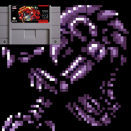
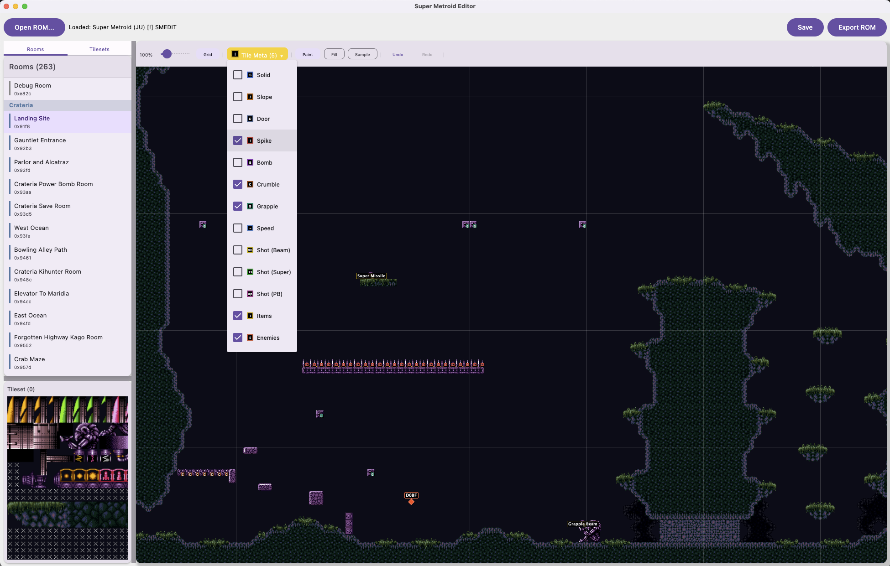
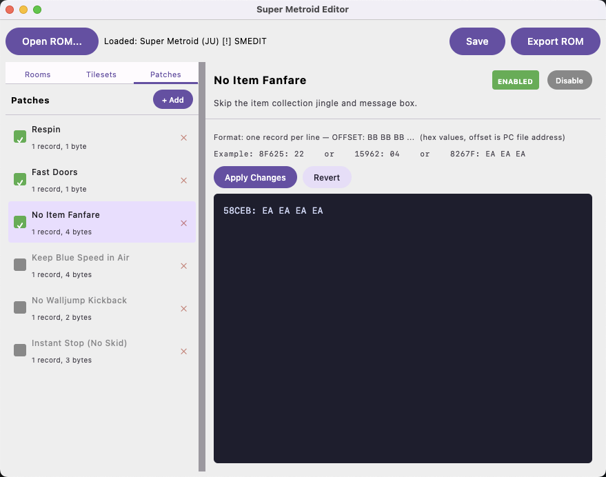
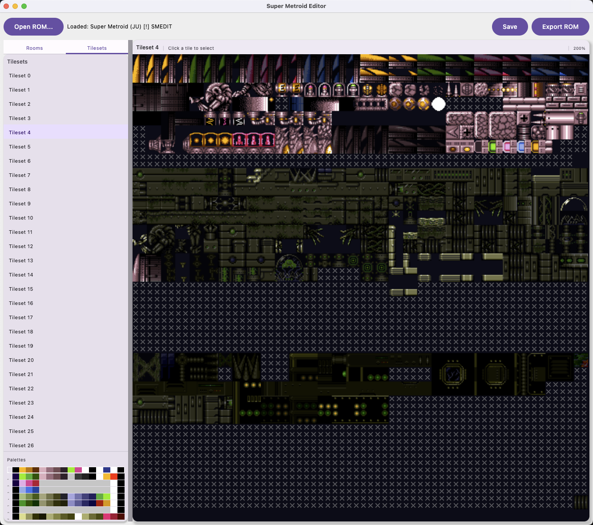

#  Super Metroid Editor (SMEDIT)

The MS Paint of Super Metroid ROM hacking. A native cross-platform desktop editor built with Kotlin/Compose.

<p>
  
  
</p>
<p>
  
</p>

## Features

- **Room Editor** — Paint, fill, erase, and sample tiles with multi-tile brush support. Right-click any block to edit block type and BTS properties. Undo/redo with full history.
- **PLM Placement** — Place and remove doors, gates, items, save stations, refill stations, and other PLMs with correct IDs and parameters.
- **Enemy Editor** — View, place, and edit enemy positions and properties per room.
- **Tileset Browser** — Browse all 29 tilesets with palette visualization and per-tile defaults.
- **Pattern System** — Save reusable tile patterns (doors, gates, platforms). Built-in patterns for all door/gate colors and directions.
- **Patch Manager** — Apply, create, and manage IPS patches. Built-in patches for common hacks (beam damage, jump height, Ceres escape time).
- **Sound Editor** — Browse and preview all in-game music tracks with cycle-accurate SPC700 emulation via blargg's snes_spc.
- **Block Overlays** — Toggleable overlays for solid, slope, door, spike, bomb, crumble, grapple, speed, shot blocks, items, and enemies.
- **Room Browser** — Browse all 263 rooms organized by area (Crateria, Brinstar, Norfair, Wrecked Ship, Maridia, Tourian, Ceres).
- **Project Files** — Save/load projects as `.smedit` JSON files. Export patched ROMs.
- **Cross-Platform** — macOS (`.dmg`), Windows (`.msi`), and Linux (`.deb`) builds with bundled JRE.

## Download

Grab the latest release for your platform from [GitHub Releases](https://github.com/kennycason/super_metroid_editor/releases).

| Platform | Format |
|----------|--------|
| macOS    | `.dmg` |
| Windows  | `.msi` |
| Linux    | `.deb` |

## Building from Source

Requires JDK 17+ and a C++ compiler (Xcode CLI tools on macOS, `g++` on Linux, MinGW on Windows).

```bash
# Clone with submodules (required for SPC audio)
git clone --recurse-submodules git@github.com:kennycason/super_metroid_editor.git
cd super_metroid_editor

# Run the editor
./gradlew :desktopApp:run

# Run tests
./gradlew :shared:jvmTest :desktopApp:jvmTest

# Package for your platform (.dmg / .msi / .deb)
./gradlew :desktopApp:packageDistributionForCurrentOS
```

If you already cloned without `--recurse-submodules`:
```bash
git submodule update --init --recursive
```

The native SPC library (`libspc`) is compiled automatically by Gradle from the `tools/snes_spc` submodule — no manual steps needed.

## CLI Export Tool

The `cli` module provides headless export of structured JSON data from a ROM with no GUI dependency.

```bash
# List all rooms
./gradlew -q :cli:runCli -Pargs="--rom rom.smc rooms"

# Export single room by handle or hex ID
./gradlew -q :cli:runCli -Pargs="--rom rom.smc room landingSite"
./gradlew -q :cli:runCli -Pargs="--rom rom.smc room 0x91F8"

# Navigation graph
./gradlew -q :cli:runCli -Pargs="--rom rom.smc graph"

# Full export to directory
./gradlew -q :cli:runCli -Pargs="--rom rom.smc export -o /tmp/sm_export"
```

## Roadmap

See [open issues](https://github.com/kennycason/super_metroid_editor/issues) for planned features and known bugs.

Planned:
- Room creation, resizing, and state management
- Custom tileset importing and tile swapping
- FX / scrolling / background layer editing
- Palette editor
- Sound Editing / Synth
- ASM support
- Free space management and bank expansion

## Contributing

Pull requests welcome. Run `./gradlew :shared:jvmTest :desktopApp:jvmTest` before submitting to make sure all tests pass.

## References

- [Metroid Construction Wiki](https://wiki.metroidconstruction.com/)
- [Kejardon's SM Documentation](https://patrickjohnston.org/ASM/ROM%20data/Super%20Metroid/Kejardon's%20docs/)
- [Patrick Johnston's Annotated Disassembly](https://patrickjohnston.org/bank/)
- [SMILE Editor](https://wiki.metroidconstruction.com/doku.php?id=sm:editor_utility_guides:smile2.5)
